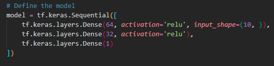
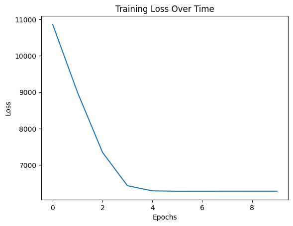
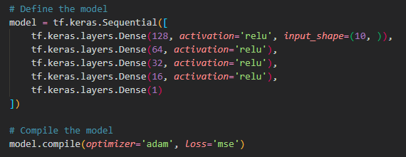
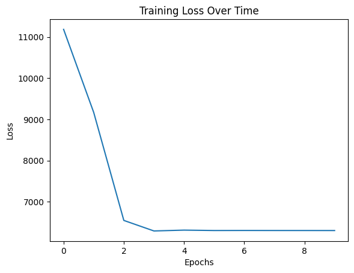
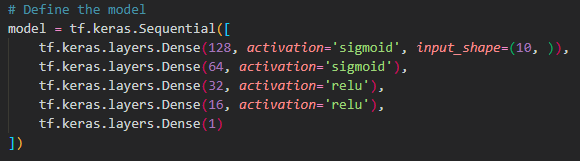
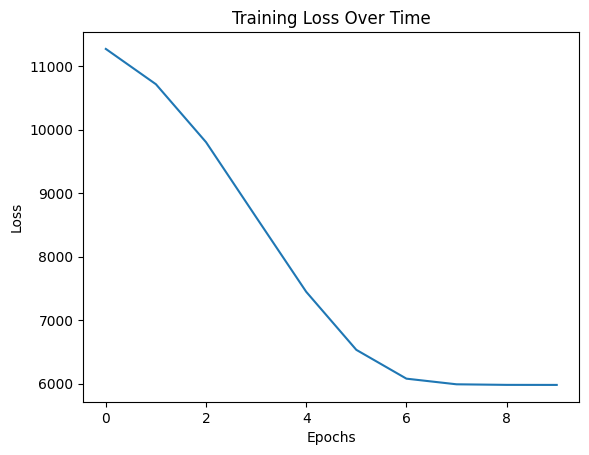
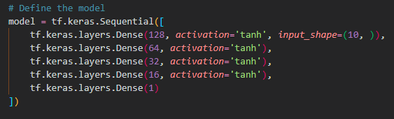
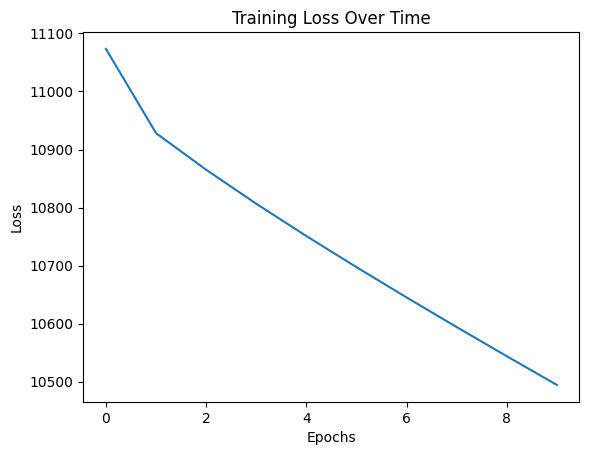
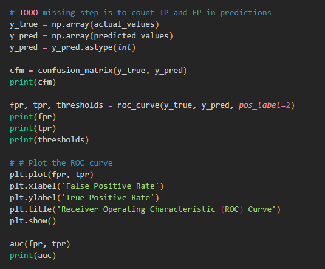

# Resultate der Experimente zu DBM von Rudolf Hofmeister

Zuerst wurde das *Project B - Book Cover* ausgewählt, aber durch die sehr langen Laufzeiten wurde das Experimentieren zu langwierig. Interessant wäre auch der Newsfeed gewesen, hier wurde der Anleitung im README File befolgt, es kam aber zu einem Error des uvicorn Moduls, welche zwar installiert ist, aber vom System nicht gefunden wurde. Schlussendlich wurde *Projekt A - TV Series* als Experiment gewählt. 

Die Experimente wurde in unterschiedliche Dateien aufgeteilt. Diese Codevervielfachung soll unerwünschte Seiteneffekte vermeiden. Gerade im Umgang mit Neuronalen Netzen sollten die verschiedenen Modellen nichts von einander wissen. 

## Die Experimente B bis E plus X

Es wurde bei den Modellen die Anzahl der Schichten und die jeweilige Aktivierungsfunktion ausgetauscht und auf Genauigkeit und Performanz untersucht. Die untersuchten Variablen *Ratings > Anzahl der Episoden* wurde beibehalten. Zu den bestehenden Evaluierungen wurden der *Mean Absolute Error* und der *R2-Score* berechnet.  

### Ursprüngliches Experiment

### Experiment B

Es wurden die sequentiellen Schichtendes neuralen Netzwerks erweitert, aber die Aktivierungsfunktion *relu* beibehalten. 

Das resultiert scheinbar in einer direkteren Annäherung an einen niedrigeren *loss*.

### Experiment C

Bei den zwei ersten Schichten aus *Experiment B* wurde die Aktivierungsfunktion *relu* auf *sigmoid* getauscht.

Hier lässt sich eine deutliche Abflachung der Loss-Reduktion erkennen. 

### Experiment D

Hier wurden alle Aktivierungsfunktionen  auf *tanh* getauscht.

Die resultierende Kurve zeigt eine deutliche Verlangsamung bei der Loss-Reduktion. Optisch fast linear fallend. 

### Experiment X

In *Experiment X* wurde versucht eine ROC Curve zu zeichnen und der AUC Wert zu berechnen. Hier fehlt noch der Schritt die TP und FP zu zählen anhand eines selbst gewählten Thresholds, welcher die Aussage trifft, ab wann wurde es richtig oder falsch prognostiziert. Das wurde aus Zeitgründen nicht mehr fertiggestellt. 

Probleme machten hier vor allem die Python Syntax und die mangelnde Praxis mit Python Programmierung. 

## Vergleichswerte

| Experiment | Predicted Series Length | Mean Squared Error | Mean Absolute Error | F2 Score |
| ----------- | ----------- | ----------- | ----------- | ----------- |
| Original | 44 | 4661.4746 | 55.5801 | -0.1536 |
| B | 43 | 4656.8257 | 55.2442 | -0.1525 |
| C | 73 | 4090.6355 | 53.084 | -0.0124 | 
| D | 7 | 7520.9180 | 58.9949 | -0.8613 | 

